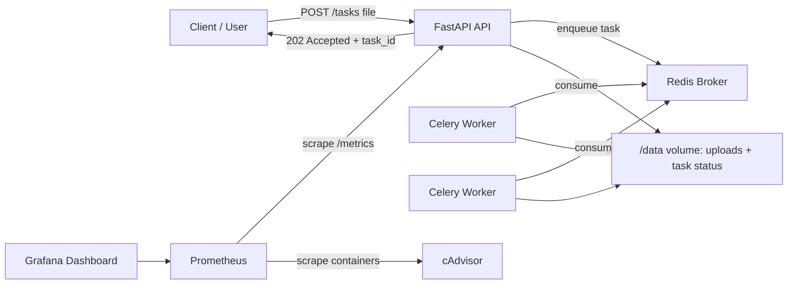

# Async Scaling Architecture with Python, Docker, and Monitoring

Production-oriented backend project that demonstrates a common real-world architecture pattern: a REST API receives heavy jobs, responds quickly with `202 Accepted`, delegates processing to a queue, and exposes system behavior through Prometheus and Grafana.

## What This Project Builds

- REST API with FastAPI for uploading files and checking task status.
- Asynchronous processing with Celery and Redis.
- Independent workers that can be scaled horizontally.
- Simple shared JSON storage for task state and results.
- Prometheus metrics for HTTP latency, created tasks, completed tasks, failed tasks, processing time, and queue size.
- Automatically provisioned Grafana dashboard for observability.
- Docker Compose stack for API, Redis, workers, Prometheus, Grafana, and cAdvisor.

## Architecture



## Functional Flow

1. The user uploads a file to `POST /tasks`.
2. FastAPI validates filename, size, and non-empty content.
3. The API stores the file under `/data/uploads`.
4. A task record is created at `/data/tasks/{task_id}.json`.
5. The API sends the job to Celery using Redis as the broker.
6. The API immediately returns `202 Accepted`, `task_id`, and `status_url`.
7. A worker consumes the task and processes the file.
8. The user polls `GET /tasks/{task_id}` until the task reaches `COMPLETED` or `FAILED`.
9. Prometheus collects metrics and Grafana displays them in real time.

## Requirements

- Docker Desktop
- Docker Compose v2
- Optional for local development without Docker: Python 3.12+

## Run in Development

```bash
docker compose up --build
```

Available services:

| Service | URL |
| --- | --- |
| API | http://localhost:8000 |
| Swagger / OpenAPI | http://localhost:8000/docs |
| Prometheus | http://localhost:9090 |
| Grafana | http://localhost:3000 |
| cAdvisor | http://localhost:8080 |

Grafana credentials:

- User: `admin`
- Password: `admin`

The dashboard is loaded automatically at:

`Grafana -> Dashboards -> Backend Observability -> Async Scaling Architecture`

## Try the System

Submit a job with the sample CSV:

```bash
curl -F "file=@samples/report.csv" http://localhost:8000/tasks
```

Expected response:

```json
{
  "task_id": "b9e62c2f-6a6d-4d8d-86fb-57b3d0c5ed68",
  "status": "QUEUED",
  "status_url": "http://localhost:8000/tasks/b9e62c2f-6a6d-4d8d-86fb-57b3d0c5ed68",
  "message": "Task accepted and queued for background processing."
}
```

Check status:

```bash
curl http://localhost:8000/tasks/<task_id>
```

When the worker finishes, the response looks like this:

```json
{
  "task_id": "b9e62c2f-6a6d-4d8d-86fb-57b3d0c5ed68",
  "status": "COMPLETED",
  "filename": "report.csv",
  "duration_seconds": 0.0123,
  "result": {
    "original_filename": "report.csv",
    "kind": "csv_analysis",
    "rows": 6,
    "columns": ["cost", "department", "month", "revenue"],
    "numeric_values": 12,
    "numeric_average": 7912.5
  }
}
```

List recent tasks:

```bash
curl http://localhost:8000/tasks
```

View raw metrics:

```bash
curl http://localhost:8000/metrics
```

## Scale Workers

The key design decision is that the API does not perform heavy processing during the HTTP request. If traffic grows, add more workers:

```bash
docker compose up --scale worker=4
```

Then observe these Grafana panels:

- `Worker CPU Usage`: CPU usage for worker containers.
- `Message Queue Size`: approximate number of queued messages in Redis.
- `API Response Time`: p50 and p95 latency per endpoint.
- `Task Throughput`: created, completed, and failed tasks.
- `Background Processing Time`: p50 and p95 background processing duration.

## Run the Production Profile

```bash
docker compose -f docker-compose.yml -f docker-compose.prod.yml up --build -d
```

Main differences:

- API runs without `--reload`.
- API can run multiple processes through `WEB_CONCURRENCY`.
- Workers use configurable concurrency through `WORKER_CONCURRENCY`.
- Services use `restart: unless-stopped`.
- Redis is not exposed to the host in the production override.

Example:

```bash
WEB_CONCURRENCY=4 WORKER_CONCURRENCY=8 docker compose -f docker-compose.yml -f docker-compose.prod.yml up --build -d
```

## Endpoints

| Method | Path | Description |
| --- | --- | --- |
| `GET` | `/health` | Basic API healthcheck |
| `POST` | `/tasks` | Receives a file and enqueues a background task |
| `GET` | `/tasks/{task_id}` | Returns task state and result |
| `GET` | `/tasks?limit=25` | Lists recent tasks |
| `GET` | `/metrics` | Prometheus metrics |

## Environment Variables

| Variable | Default | Purpose |
| --- | --- | --- |
| `REDIS_URL` | `redis://redis:6379/0` | Redis connection used to inspect queue size |
| `CELERY_BROKER_URL` | `redis://redis:6379/0` | Celery broker |
| `CELERY_RESULT_BACKEND` | `redis://redis:6379/1` | Celery result backend |
| `TASK_STORAGE_PATH` | `/data/tasks` | JSON task state files |
| `UPLOAD_DIR` | `/data/uploads` | Uploaded files |
| `MAX_UPLOAD_MB` | `25` | Maximum upload size per file |
| `PROMETHEUS_MULTIPROC_DIR` | `/tmp/prometheus` | Multiprocess Prometheus metric files |

## Project Structure

```text
.
├── app/
│   ├── main.py          # FastAPI app, endpoints, and /metrics
│   ├── tasks.py         # Celery tasks and file processing
│   ├── celery_app.py    # Celery configuration
│   ├── config.py        # Environment-based settings
│   ├── metrics.py       # Prometheus metrics
│   ├── models.py        # Pydantic models
│   └── storage.py       # Simple task state persistence
├── monitoring/
│   ├── prometheus/      # Scrape configuration
│   └── grafana/         # Provisioned datasource and dashboard
├── samples/             # Example input files
├── tests/               # Unit and API tests
├── Dockerfile
├── docker-compose.yml
├── docker-compose.prod.yml
└── README.md
```

## Why This Architecture Scales

The API remains available because it does not process the file inside the HTTP request. Heavy work is decoupled through a queue. If load increases, workers can be scaled without changing the API or the client contract.

Key points:

- `202 Accepted` avoids blocking the user during long-running jobs.
- Redis absorbs temporary traffic spikes.
- Celery provides retries and worker concurrency.
- Independent workers enable horizontal scaling.
- Prometheus and Grafana show whether the bottleneck is the API, the queue, or the workers.

## What the Worker Processes

The worker computes general metadata:

- Original filename.
- File size in bytes.
- SHA-256 hash.

For `.csv` files:

- Number of rows.
- Detected columns.
- Number of numeric values.
- Average of numeric values.

For `.txt`, `.log`, `.md`, and `.json` files:

- Characters.
- Lines.
- Words.
- JSON validity when applicable.

For other formats:

- Basic binary metadata.

## Validation and Quality

Install local dependencies:

```bash
python -m venv .venv
.venv\Scripts\activate
pip install -r requirements-dev.txt
```

Run tests:

```bash
pytest
```

Run linting:

```bash
ruff check app tests
```

## Production Notes

This project uses JSON files to keep the demo simple and easy to inspect. In a real platform, task state would usually live in PostgreSQL, DynamoDB, or Redis with controlled expiration.

Natural next improvements:

- JWT or OAuth2 authentication.
- File storage in S3, MinIO, or GCS.
- Relational database for history and auditing.
- Prometheus Alertmanager alerts.
- Dead letter queue for exhausted tasks.
- Dedicated exporter for worker metrics.
